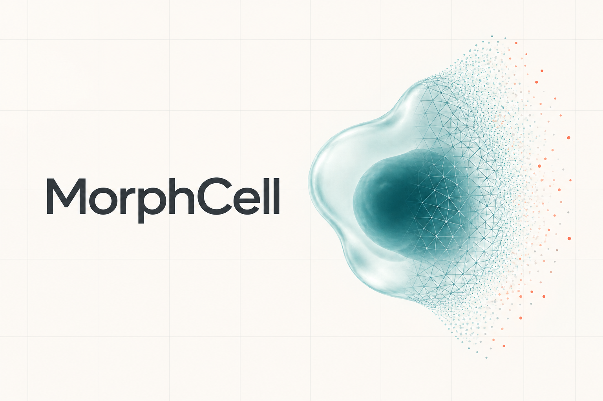

<h1 align="center">MorphCell</h1>

<p align="center">
  <a href="https://pytorch.org/">
    
  </a>
  <a href="https://lightning.ai/">
    
  </a>
  <a href="https://hydra.cc/">
    
  </a>
  <a href="https://docs.astral.sh/uv/">
    
  </a>
</p>



MorphCell is a point-cloud learning framework for three-dimensional cell morphology. The repository provides the model implementations, data loaders, Hydra configurations and training scripts used in the MorphCell study.

## Installation

MorphCell uses [uv](https://docs.astral.sh/uv/) to manage a reproducible Python 3.12 environment. The locked environment includes PyTorch 2.7.1 with CUDA 11.8 and the CUDA-based `pointnet2-ops` extension.

### Requirements

- Python 3.12
- An NVIDIA GPU with a CUDA 11.8-compatible driver
- CUDA Toolkit 11.8, including `nvcc`
- A C/C++ compiler and Ninja

Install the build tools with:

```bash
sudo apt update
sudo apt install -y build-essential ninja-build
```

Install CUDA Toolkit 11.8 from the [NVIDIA CUDA archive](https://developer.nvidia.com/cuda-11-8-0-download-archive), then verify the installation:

```bash
nvcc --version
```

Install uv and create the environment from the repository root:

```bash
curl -LsSf https://astral.sh/uv/install.sh | sh
uv sync
```

Activate the environment and verify the main dependencies:

```bash
source .venv/bin/activate
python -c "import torch, pointnet2_ops, morphcell; print(torch.__version__)"
```

## Datasets

Dataset preparation code and source information are available in the [MorphCell-Datasets repository](https://github.com/Visytudz/MorphCell-Datasets).

By default, MorphCell looks for data in `datasets/` at the repository root. Set `MORPHCELL_DATA_ROOT` to use another location:

```bash
export MORPHCELL_DATA_ROOT=/absolute/path/to/datasets
```

Arrange the downloaded files as follows. This is the directory structure used by the supplied configurations:

```text
datasets/
├── colon/
│   ├── metadata.json
│   ├── MEM/
│   │   └── mem.h5
│   └── NUC/
│       └── nuc.h5
├── intrA/
│   ├── metadata.json
│   └── set1/
│       └── intrA.h5
├── redblood/
│   ├── metadata.json
│   └── set1/
│       └── redblood.h5
├── wheat/
│   ├── metadata.json
│   └── set1/
│       └── wheat.h5
└── shapenet55-34/
    ├── pcl/
    │   ├── 02691156-1a04e3eab45ca15dd86060f189eb133.npy
    │   └── ...
    └── splits/
        └── ...
```

The biological point-cloud datasets are distributed as HDF5 files in the data repository. ShapeNet55-34 follows the structure provided by the [Point-BERT dataset instructions](https://github.com/Julie-tang00/Point-BERT/blob/49e2c7407d351ce8fe65764bbddd5d9c0e0a4c52/DATASET.md).

Each biological dataset includes a `metadata.json` file that maps integer labels to class names:

```json
{
  "label2name": {
    "0": "class_0",
    "1": "class_1"
  }
}
```

## Training

Run training commands from the repository root after activating the uv environment. Four pretraining entry points are provided:

```bash
bash scripts/pretrain_dfn.sh
bash scripts/pretrain_direct+self.sh
bash scripts/pretrain_cross+self.sh
bash scripts/pretrain_cytodl_point.sh
```

| Script                     | Configuration                               | Output directory                          |
| -------------------------- | ------------------------------------------- | ----------------------------------------- |
| `pretrain_dfn.sh`          | `pretrain_dfn` with a DGCNN encoder         | `outputs/pretrain/pretrain_dfn_dgcnn/`    |
| `pretrain_direct+self.sh`  | direct reconstruction with self-supervision | `outputs/pretrain/pretrain_direct+self/`  |
| `pretrain_cross+self.sh`   | cross reconstruction with self-supervision  | `outputs/pretrain/pretrain_cross+self/`   |
| `pretrain_cytodl_point.sh` | point-based CytoDL pretraining              | `outputs/pretrain/pretrain_cytodl_point/` |

The DFN baseline is derived from [CellShape](https://github.com/Sentinal4D/cellshape). The point-based CytoDL baseline is derived from [CytoDL](https://github.com/AllenCell/cyto-dl/tree/br_release).
